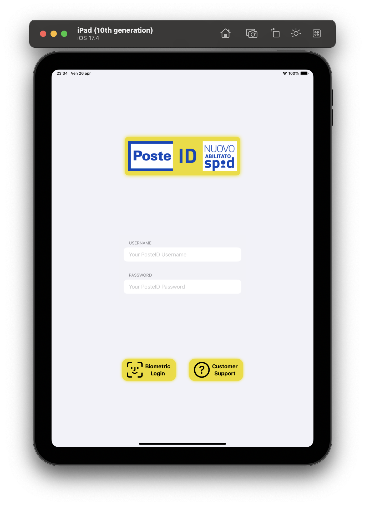
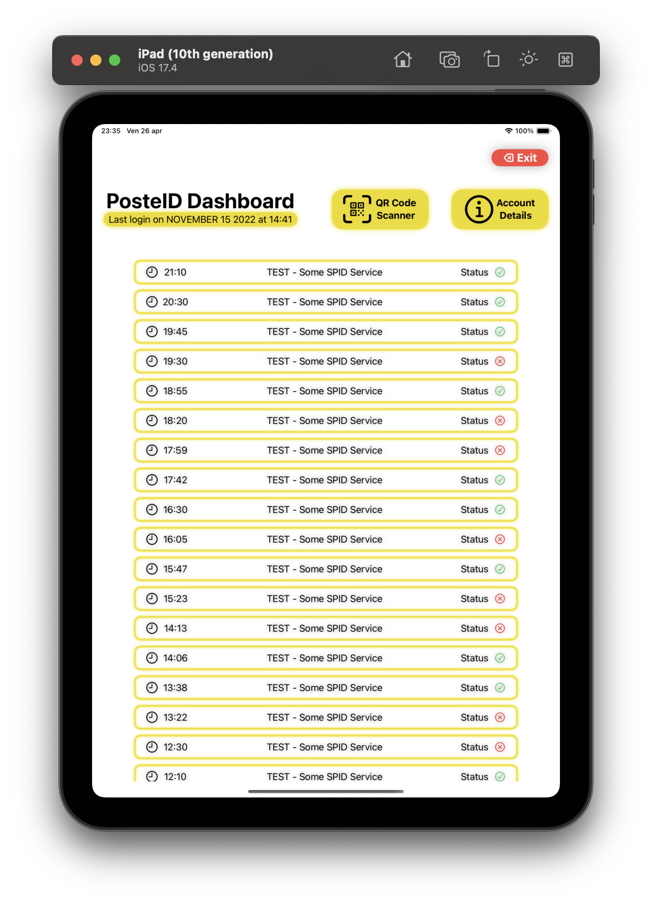

# FakePosteID
FakePosteID is a new design concept based on PosteID from [Poste Italiane](https://www.poste.it/), an Italian SPID identity provider.
By no means this is a commercial product, since i do not own the assets and everything else that belongs to Poste Italiane S.P.A.

It was created for a re-design challenge.

A basic description of it's features:
- Local authentication with biometrics
- Fully re-designed login page and profile information
- Optimized for iPadOS and iOS

That's it really.

# Screenshots

Login page | Dashboard
:-------------------------:|:-------------------------:
 | 
